# SnowPeak: Distributed Ski Resort Monitoring System
[]()
[](LICENSE)
[]()

[]()
[]()
[]()
[]()

[]()
[]()
[](#)
[](#)
[](#)
[](#)
[](#)


A distributed system for real-time monitoring and control of ski resort lifts.

## Prerequisites

Before installation, ensure you have the following dependencies installed:

- Kubernetes cluster or Minikube (v1.20+)
- kubectl CLI tool
- Container runtime (preferably Docker)
- Operating System: Windows 10/11 or any modern UNIX based OS

## Installation

1. Clone the repository:
   ```bash
   git clone https://github.com/Pillangocska/SnowPeak.git
   cd snowpeak
   ```

2. Deploy the application:

   **Windows**:
   ```powershell
   .\k8s\start_on_windows.ps1
   ```

   **Linux/macOS**:
   ```bash
   ./k8s/start_on_unix_based.sh
   ```
   **Docker Compose**
   ```bash
   docker-compose up -d --build
   ```
## Architecture

```mermaid
graph TB
    %% External Access
    User(("👤 User"))
    Admin(("👤 Admin"))

    %% Frontend
    FrontendLB[Frontend LoadBalancer]
    Frontend[Frontend Service]

    %% Backend Services
    Backend[Backend Service]

    %% Message Broker
    RabbitMQLB[RabbitMQ LoadBalancer]
    RabbitMQ[RabbitMQ Service]

    %% Authentication
    KeycloakLB[Keycloak LoadBalancer]
    Keycloak[Keycloak Service]
    KeycloakDB[(Keycloak PostgreSQL)]

    %% Application Database
    AppDB[(Application PostgreSQL)]

    %% Ski Lifts
    Lift1[Ski Lift 1]
    Lift2[Ski Lift 2]
    Lift3[Ski Lift 3]

    %% Persistent Storage
    Storage{{Persistent Storage}}

    %% Connections
    User --> FrontendLB
    Admin --> FrontendLB
    FrontendLB --> Frontend
    Frontend --> Backend
    Frontend -.-> RabbitMQ
    Backend --> AppDB
    Backend --> RabbitMQ
    Backend --> Keycloak

    Lift1 --> RabbitMQ
    Lift2 --> RabbitMQ
    Lift3 --> RabbitMQ

    KeycloakLB --> Keycloak
    Keycloak --> KeycloakDB

    RabbitMQLB --> RabbitMQ
    RabbitMQ --> Storage

    AppDB --> Storage
    KeycloakDB --> Storage

    %% Styles
    classDef loadbalancer fill:#f9f,stroke:#333,stroke-width:2px,color:black
    classDef service fill:#bbf,stroke:#333,stroke-width:2px,color:black
    classDef database fill:#fbb,stroke:#333,stroke-width:2px,color:black
    classDef storage fill:#bfb,stroke:#333,stroke-width:2px,color:black
    classDef lift fill:#ffb,stroke:#333,stroke-width:2px,color:black

    class FrontendLB,RabbitMQLB,KeycloakLB loadbalancer
    class Frontend,Backend,RabbitMQ,Keycloak service
    class AppDB,KeycloakDB database
    class Storage storage
    class Lift1,Lift2,Lift3 lift
```



## Documentation

For detailed documentation, please visit our [Docs](./docs/).

## License

This project is licensed under the Apache License - see the [LICENSE](LICENSE) file for details.


---

© 2024 SnowPeak Team. All rights reserved.
